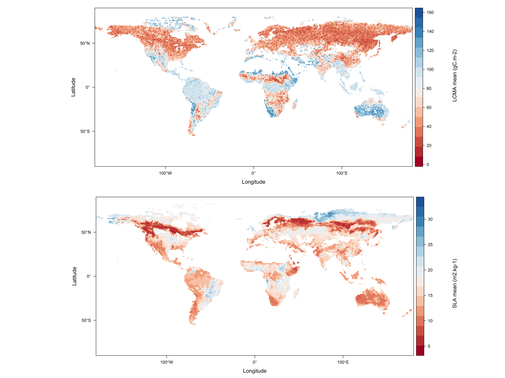
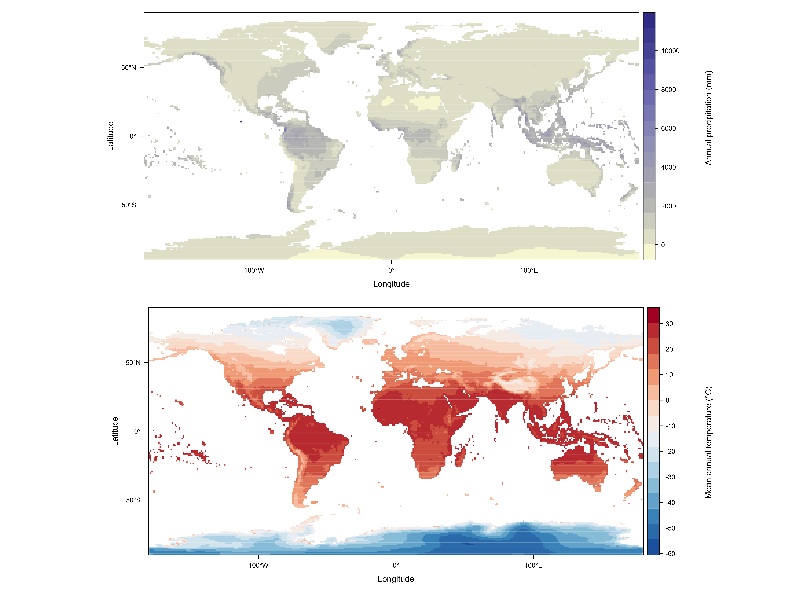

# Appendices

## Appendix A 

This appendix contains the spatial representation of LCMA and SLA mean and standard deviation values (fig. 1), as retrieved from from Bloom *et al.* (2015) and Butler *et al.* (2017), respectively. It also contains the climate data, i.e. total annual precipitation (mm) and mean annual temperature (°C), retrieved from WorldClim v2.1 database (fig. 2).

```{r figures from publications, echo=FALSE, fig.cap="(Left) global distribution of LCMA mean estimates, from Bloom et al. (2015)'s publication. (Right) global distribution of SLA meane estimates from Butler et al. (2017)'s publication.", out.width='.99\\linewidth', fig.width=10, fig.height=6,fig.show='hold',fig.pos="H",fig.align='center'}

```


```{r figures from worldclim, echo=FALSE, fig.cap="(Top) Total annual precipitation (mm). (Bottom) Mean annual temperature (°C). Both datasets are averaged over 1970-2000 at 10 minutes spatial resolution. From WorldClim v2.1.", out.width='1\\linewidth', fig.show='hold',fig.pos="H",fig.align='center', fig.width=10,fig.height=7}

```

## Appendix B

This appendix contains the code for the custom functions used during this project, in order to facilitate automatistion of data manipulation and visualisation. 

```{r}
## custom functions ####

# convert raster to data frame
mask.to.df <- function(x){
  new.list <- list()
  for (i in 1:length(x)){
    df <- raster::as.data.frame(x[[i]], xy =TRUE)
    name.df <- paste("df",names(x)[i],sep = ".")
    new.list[[name.df]] <- df
  }
  new.list
}

# joining dataframes 
join.f <- function(x,y){
  new.list <- list()
  join <- mapply(left_join, x, y,SIMPLIFY = FALSE)
  join <- lapply(join, na.omit)
  name.df <- names(x)[i]
  new.list[[name.df]] <- join
}

# masking the biomes by continent 
mask.biome.f <- function(x,y){
  new.list <- list()
  for (i in 1:length(x)){
    for (j in 1:length(y)){
      mask.biome <- raster::mask(x[[i]],y[[j]])
      if (!is.infinite(mask.biome@data@min)&!is.infinite(mask.biome@data@max)){
        name <- paste(names(x)[i],names(y)[j],sep = " ")
        new.list[[name]] <- mask.biome
      }
      else
        NULL
    }
  }
  new.list
}

# density plots with percentage overlap (modif. from overlapping package) 
  # for SLA mean
my.final.plot.sla <- function (x, OV = NULL){
  AREA <- NULL
  for (i1 in 1:(length(x) - 1)) {
    for (i2 in (i1 + 1):(length(x))) {
      A <- data.frame(x = x[[i1]], group = names(x)[i1], 
                      k = paste(names(x)[i1], names(x)[i2], sep = "-", 
                                collapse = ""))
      B <- data.frame(x = x[[i2]], group = names(x)[i2], 
                      k = paste(names(x)[i1], names(x)[i2], sep = "-", 
                                collapse = ""))
      AREA <- rbind(AREA, rbind(A, B))
    }
  }
  if (!is.null(OV)) {
    OV <- data.frame(OV = OV, k = names(OV))
    AREA <- merge(AREA, OV, by = "k")
    AREA$k <- paste0(AREA$k, " (ov. perc. ", round(AREA$OV * 
                                                     100), ")")
  }
  ggplot(AREA, aes(x = x)) + facet_wrap(~k) + 
    geom_density(aes(fill = AREA$group), alpha = 0.35) + 
    xlab("\nSLA mean (m2.kg-1)") + 
    ylab("")+
    theme_classic()+
    theme(legend.title = element_blank())+
    scale_color_brewer(palette = "Set1")+
    scale_x_continuous(expand = c(0,0))+
    scale_y_continuous(expand = c(0,0))
}

my.overlap.sla <- function (x, nbins = 1024, plot = FALSE, partial.plot = FALSE, 
                            boundaries = NULL, ...){
  if (is.null(names(x))) 
    names(x) <- paste("Y", 1:length(x), sep = "")
  dd <- OV <- FUNC <- DD <- xpoints <- COMPTITLE <- NULL
  for (j in 1:length(x)) {
    if (!is.null(boundaries)) {
      Lbound <- lapply(boundaries, FUN = length)
      if ((Lbound$from == 1) & (Lbound$to == 1)) {
        warning("Boundaries were set all equals")
        boundaries$from <- rep(boundaries$from, length(x))
        boundaries$to <- rep(boundaries$to, length(x))
      }
      else {
        if ((Lbound$from != length(x)) | (Lbound$to != 
                                          length(x))) {
          stop("Boundaries not correctly defined")
        }
      }
      from = boundaries$from[j]
      to = boundaries$to[j]
      dj <- density(x[[j]], n = nbins, from = from, to = to, 
                    ...)
    }
    else {
      dj <- density(x[[j]], n = nbins, ...)
    }
    ddd <- data.frame(x = dj$x, y = dj$y, j = names(x)[j])
    FUNC <- c(FUNC, list(with(ddd, approxfun(x, y))))
    dd <- rbind(dd, ddd)
  }
  for (i1 in 1:(length(x) - 1)) {
    for (i2 in (i1 + 1):(length(x))) {
      comptitle <- paste0(names(x)[i1], "-", names(x)[i2])
      dd2 <- data.frame(x = dd$x, y1 = FUNC[[i1]](dd$x), 
                        y2 = FUNC[[i2]](dd$x))
      dd2[is.na(dd2)] <- 0
      dd2$ovy <- apply(dd2[, c("y1", "y2")], 1, min)
      dd2$ally <- apply(dd2[, c("y1", "y2")], 1, max, na.rm = TRUE)
      dd2$dominance <- ifelse(dd2$y1 > dd2$y2, 1, 2)
      dd2$k <- comptitle
      OV <- c(OV, sum(dd2$ovy, na.rm = TRUE)/sum(dd2$ally, 
                                                 na.rm = TRUE))
      dd2 <- dd2[order(dd2$x), ]
      CHANGE <- dd2$x[which(dd2$dominance[2:nrow(dd2)] != 
                              dd2$dominance[1:(nrow(dd2) - 1)])]
      xpoints <- c(xpoints, list(CHANGE))
      if (partial.plot) {
        gg <- ggplot(dd2, aes(x, dd2$y1)) + theme_bw() + 
          geom_vline(xintercept = CHANGE, lty = 2, color = "#cccccc") + 
          geom_line() + geom_line(aes(x, dd2$y2)) + 
          geom_line(aes(x,dd2$ovy), color = "red") + 
          geom_line(aes(x,dd2$ally), color = "blue") + 
          ggtitle(comptitle) + 
          xlab("") + 
          ylab("") + 
          theme(plot.title = element_text(hjust = 0.5),
                legend.title = element_blank())
        print(gg)
      }
      DD <- rbind(DD, dd2)
      COMPTITLE <- c(COMPTITLE, comptitle)
    }
  }
  names(xpoints) <- names(OV) <- COMPTITLE
  if (plot) 
    print(my.final.plot.sla(x, OV))
  return(list(DD = DD, OV = OV, xpoints = xpoints))
}

  # for SLA standard deviation
my.final.plot.std <- function (x, OV = NULL){
  AREA <- NULL
  for (i1 in 1:(length(x) - 1)) {
    for (i2 in (i1 + 1):(length(x))) {
      A <- data.frame(x = x[[i1]], group = names(x)[i1], 
                      k = paste(names(x)[i1], names(x)[i2], sep = "-", 
                                collapse = ""))
      B <- data.frame(x = x[[i2]], group = names(x)[i2], 
                      k = paste(names(x)[i1], names(x)[i2], sep = "-", 
                                collapse = ""))
      AREA <- rbind(AREA, rbind(A, B))
    }
  }
  if (!is.null(OV)) {
    OV <- data.frame(OV = OV, k = names(OV))
    AREA <- merge(AREA, OV, by = "k")
    AREA$k <- paste0(AREA$k, " (ov. perc. ", round(AREA$OV * 
                                                     100), ")")
  }
  ggplot(AREA, aes(x = x)) + facet_wrap(~k) + 
    geom_density(aes(fill = AREA$group), alpha = 0.35) + 
    xlab("\nSLA StDev (m2.kg-1)") + 
    ylab("")+
    theme_classic()+
    theme(legend.title = element_blank())+
    scale_color_brewer(palette = "Set1")+
    scale_x_continuous(expand = c(0,0))+
    scale_y_continuous(expand = c(0,0)) 
}
my.overlap.std <- function (x, nbins = 1024, plot = FALSE, partial.plot = FALSE, 
                            boundaries = NULL, ...){
  if (is.null(names(x))) 
    names(x) <- paste("Y", 1:length(x), sep = "")
  dd <- OV <- FUNC <- DD <- xpoints <- COMPTITLE <- NULL
  for (j in 1:length(x)) {
    if (!is.null(boundaries)) {
      Lbound <- lapply(boundaries, FUN = length)
      if ((Lbound$from == 1) & (Lbound$to == 1)) {
        warning("Boundaries were set all equals")
        boundaries$from <- rep(boundaries$from, length(x))
        boundaries$to <- rep(boundaries$to, length(x))
      }
      else {
        if ((Lbound$from != length(x)) | (Lbound$to != 
                                          length(x))) {
          stop("Boundaries not correctly defined")
        }
      }
      from = boundaries$from[j]
      to = boundaries$to[j]
      dj <- density(x[[j]], n = nbins, from = from, to = to, 
                    ...)
    }
    else {
      dj <- density(x[[j]], n = nbins, ...)
    }
    ddd <- data.frame(x = dj$x, y = dj$y, j = names(x)[j])
    FUNC <- c(FUNC, list(with(ddd, approxfun(x, y))))
    dd <- rbind(dd, ddd)
  }
  for (i1 in 1:(length(x) - 1)) {
    for (i2 in (i1 + 1):(length(x))) {
      comptitle <- paste0(names(x)[i1], "-", names(x)[i2])
      dd2 <- data.frame(x = dd$x, y1 = FUNC[[i1]](dd$x), 
                        y2 = FUNC[[i2]](dd$x))
      dd2[is.na(dd2)] <- 0
      dd2$ovy <- apply(dd2[, c("y1", "y2")], 1, min)
      dd2$ally <- apply(dd2[, c("y1", "y2")], 1, max, na.rm = TRUE)
      dd2$dominance <- ifelse(dd2$y1 > dd2$y2, 1, 2)
      dd2$k <- comptitle
      OV <- c(OV, sum(dd2$ovy, na.rm = TRUE)/sum(dd2$ally, 
                                                 na.rm = TRUE))
      dd2 <- dd2[order(dd2$x), ]
      CHANGE <- dd2$x[which(dd2$dominance[2:nrow(dd2)] != 
                              dd2$dominance[1:(nrow(dd2) - 1)])]
      xpoints <- c(xpoints, list(CHANGE))
      if (partial.plot) {
        gg <- ggplot(dd2, aes(x, dd2$y1)) + theme_bw() + 
          geom_vline(xintercept = CHANGE, lty = 2, color = "#cccccc") + 
          geom_line() + geom_line(aes(x, dd2$y2)) + 
          geom_line(aes(x,dd2$ovy), color = "red") + 
          geom_line(aes(x,dd2$ally), color = "blue") + 
          ggtitle(comptitle) + 
          xlab("") + 
          ylab("") + 
          theme(plot.title = element_text(hjust = 0.5),
                legend.title = element_blank())
        print(gg)
      }
      DD <- rbind(DD, dd2)
      COMPTITLE <- c(COMPTITLE, comptitle)
    }
  }
  names(xpoints) <- names(OV) <- COMPTITLE
  if (plot) 
    print(my.final.plot.std(x, OV))
  return(list(DD = DD, OV = OV, xpoints = xpoints))
}

## extracting p-values from lm summary (credits to Stephen Turner): 
#gettinggeneticsdone.blogspot.com/2011/01/
#rstats-function-for-extracting-f-test-p.html
lmp <- function (modelobject) {
  if (class(modelobject) != "lm") stop("Not an object of class 'lm' ")
    if (modelobject[["df.residual"]]!=0){ # if the residual is not = 0 
      f <- summary(modelobject)$fstatistic
      p <- pf(f[1],f[2],f[3],lower.tail=F)
      attributes(p) <- NULL
      return(p)
    }
  else
    modelobject <- NULL
}

# perform calculations of statistics iteratively
  # linear regression
lm.f <- function(x){
  lm <- lapply(x, function(dat) lm(dat[,4] ~ dat[,3],data=dat))
}

# step-by-step calculation of r-squared, and of RMSE and bias 
stats.f <- function(x){
  lapply(x,function(df){
    df$c_mean <- mean(df$cardamom)      
    df$b_mean <- mean(df$butler)
    df$diff_butler <- df$butler-df$b_mean
    df$diff_butler2<- df$diff_butler^2
    df$sum_diff_butler2 <-sum(df$diff_butler2)
    df$slope_bf <-sum((df$cardamom-df$c_mean)*(df$butler-df$b_mean))/
      sum((df$cardamom-df$c_mean)^2)
    df$b_intercept <- df$b_mean - (df$slope_bf*df$c_mean)
    df$new_b_val <- df$b_intercept + (df$slope_bf*df$cardamom)
    df$dist_mean_new_b <- df$new_b_val - df$b_mean
    df$sqrd_dist_b <- df$dist_mean_new_b^2
    df$sum_sqrd_dist_b <- sum(df$sqrd_dist_b)
    df$sla_r2 <- df$sum_sqrd_dist_b / df$sum_diff_butler2
    df$bias_av <- bias(df$butler, df$cardamom)
    df$bias_row <- df$butler - df$cardamom
    df$rmse_av <- rmse(df$butler, df$cardamom)
    df$rmse_row <- sqrt((df$butler - df$cardamom)^2)
    df
  })
}

# function for kableExtra, from Michael Harper (not modified):
#stackoverflow.com/questions/28166168/
#how-to-change-fontface-bold-italics-for-a-cell-in-a-kable-table-in-rmarkdown
format_cells <- function(df, rows ,cols, value = c("italics", "bold", "strikethrough")){
  
  # select the correct markup
  map <- setNames(c("*", "*", "~~"), c("italics", "bold", "strikethrough"))
  markup <- map[value]  
  
  for (r in rows){
    for(c in cols){
      
      # Make sure values are not factors
      df[[c]] <- as.character( df[[c]])
      
      # Update formatting
      df[r, c] <- paste0(markup, df[r, c], markup)
    }
  }
  
  return(df)
}

```

