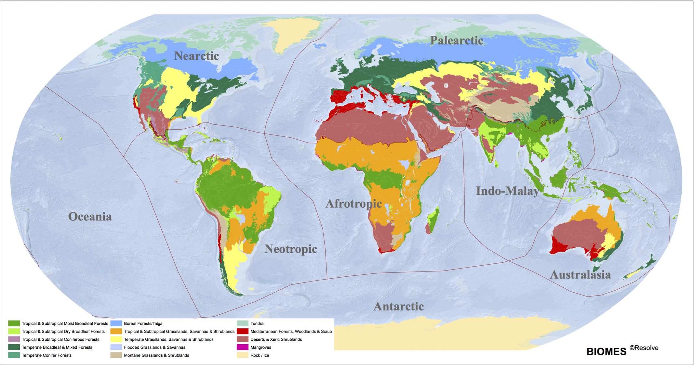

```{r libraries to open, include=F}
library(ncdf4)
library(RColorBrewer)
library(ggplot2)
library(raster)
library(tidyverse)
library(tidyr)
library(SimDesign)
library(Metrics)
library(gplots)
library(reshape2)
library(purrr)
library(grid)
library(diffeR)
library(PerformanceAnalytics)
library(viridis)
library(hrbrthemes)
library(lattice)
library(data.table)
library(ggpubr)
library(LSD)
library(MASS) # do i need it?
library(rworldmap)
library(Hmisc)
library(sp)
library(ggExtra)
library(formattable)
library(sf)
library(kableExtra)
library(rasterVis)
library(overlapping)
library(rworldmap)
library(rgeos)
library(maptools)
library(cleangeo)
library(tiff)
```

```{r datasets open, include=F}
cardamom_sla <- raster("./DATA/CARDAMOM_2001_2010_LCMA_zeros.nc", 
                       varname="sla")
cardamom_sla_std <- raster("./DATA/CARDAMOM_2001_2010_LCMA_zeros.nc", 
                           varname="sla_std")
butler_sla <- raster("./DATA/Butler_Leaftraits_Processed_1x1_zeros.nc", 
                     varname="sla")
butler_sla_std <- raster("./DATA/Butler_Leaftraits_Processed_1x1_zeros.nc", 
                         varname="sla_std")
```

# Methods

\vspace{0.5 cm}

## Datasets 
### *Plant Functional Traits datasets and publications*
I retrieved the estimates of interest from Bloom *et al* (2015) and Butler *et al.* (2017) publications (Appendix A). 

The mean and uncertainty estimates from Bloom *et al.* (2015) relate to Leaf Carbon mass per Mean Area (gC/m^2). This variable was calculated from a fusion (DALEC2) of MODIS satellite imagery of leaf area and biomass, and a Markov Chain Monte Carlo MDF algorithm, to cover for absence of empirical baseline data, over the period ranging from 2001 to 2010. The mean and related uncertainties are derived from 4,000 samples within each pixel. The variables are mapped at a 1° x 1° (360 x 180) spatial resolution. This data can be downloaded from datashare.is.ed.ac.uk/handle/10283/875. 

Mean and standard deviation estimates from Butler *et al.* (2017) relate to Specific Leaf Area (m^2/kg). This data was calculated from the fusion of the largest global Categorical Traits dataset (TRY) - a collection of world-wide field-based data sampling as of 2016 - and a Bayesian framework. The mean and standard deviation variables are presented as a summary of the full log-normal distribution within each pixel. Most measurements are derived from a subset of global regions, i.e. North America, Europe, Australia, China, Japan and Brazil. The variables are mapped at a 0.5° x 0.5° (720 x 180) spatial resolution.

Both datasets present only one time dimension. I used the dataset from Bloom *et al.* (2015) as the "benchmark" to which I compared the "model" dataset from Butler *et al.* (2017).

### *Other datasets and databases*
I used the Ecoregions17 database to retrieve the spatial extents of the 14 major biomes across the world (fig. 2). The dataset is available to download from ecoregions2017.appspot.com/. I used *rworldmap* package from R, to obtain the spatial extents of the 6 continents. I also used historical climate data (i.e. mean annual temperature and total annual precipitation), averaged for the years 1970-2000 at 10 minutes spatial resolution (~340 km^2), from WorldClim database (Appendix A). These datasets can be downloaded from worldclim.org/data/worldclim21.html (BIO01 and BIO12).

```{r figures from ecoregions17, echo=FALSE, fig.cap="14 major biomes as retrieved from Supplementary Materials by Dinerstein et al. (2017)", out.width='.99\\linewidth', fig.show='hold',fig.pos="H",fig.align='center'}

```

## Data manipulation

The state of the estimates at retrieval required standardisation in order to be compared. I aggregated the spatial resolution of SLA from Butler *et al.* (2017) so that it matched with the 1° x 1° from Bloom *et al.* (2015). I converted LCMA (gC/m^2), from Bloom *et al.* (2015), to SLA (m^2/kg) [1]. I did so knowing that LCMA measures the carbon content within the leaf, thus representing 50% of the its dry-biomass equivalent (LMA) *REF*, and that SLA is the inverse of LMA. Unit conversion from gC/m^2 to m^2/kg was also necessary to ensure standardisation of the two SLA estimates. I executed all conversions within the Linux environment, though this can be done with any programming language at disposition. I carried out this calculation for both mean and standard deviation: 

\begin{centering}

\vspace{0.5 cm}

\normalsize 

[1] {SLA =} $\displaystyle \frac{1}{2 \times LCMA}$


\end{centering}
\vspace{0.5 cm}

I created subsets of the two SLA datasets at three different spatial extents: by latitudinal gradients, by biomes across the world and by biomes split further by continent. 
The splitting by latitude mainly takes into account the climatic differences observed from tropics to polar regions. I determined the range of the different climatic zones following convention, thus extracting SLA data at spatial extents of tropical latitudes between 23.5°S and 23.5°N, sub-tropics between 23.5°S/N and 35°S/N, temperate between 35°S/N and 66.5°S/N and North pole between 66.5°N and 90°N. There were no data available for the South pole from Bloom *et al.* (2015) and Butler *et al.* (2017). The splitting by biome takes into account the vegetation dominance and also climatic variability across the world, thus increasing the subdivision of data points. Furthermore, the splitting of biomes by continents considers the geographical variability between the various land masses, in conjunction with the vegetation dominance and the climatic differences I extracted the spatial polygons representing the 14 major biomes, and those representing the 6 continents, from Ecoregions17 and *rworldmap*, respectively. I masked the two SLA datasets over these spatial polygons, so as to exclude all data points not confined within the polygon coordinates.  
Lastly, I prepared the climate datasets from WorldClim by changing their original spatial resolution (0,1667° x 0,1667°) to match that of the SLA datasets (1° x 1°).

## Visual analysis 
In order to visualise the spatial distribution of the SLA mean and standard deviation estimates, I first set them at the same scale. Following, I created heatscatters to show the relationship between mean and standard deviation estimates. Heatscatters are a useful visualisation tool to observe the correlation between two continuous variables, and assess the concentration of the data points in the space with a color encoded Kernel density estimation. I also produced density plots grouped by dataset, and I calculated the percentage of the area of overlap between the two density curves. I could relate this percentage to the count of stipples within the stippling maps I later produced. The stippling process involved calculating which mean and standard deviation estimates of the model fell within the 25th and 95th confidence interval of mean SLA of the benchmark. I represented this by plotting spatially the model mean and stdev data and overlaying the results from the stippling. This map is useful for showing the spatial distribution of the model estimates which are more closely related to those of the benchmark. SHOULD MENTION THE SCATTERPLOT OF THE DATA POINTS GROUPED BY LAT/BIOMES/BIOMESBYCONT!!! STILL TO DO.
I repeated the analysis at the four different spatial extents, assuming that differences in overlap between benchmark and model would be more evident when accounting for environmental and geographical variability across the world.
When testing the sensitivity of the SLA datasets with climate data, I first plotted the spatial correlation between SLA estimates and climate data. I then created a 2d density graph, where I could visualise the spatial distributions of the SLA estimates in relation to climate and also the extent to which these overlapped. I then calculated the percentage overlap between the two density distributions.

## Statistical analysis
I tested the degree of overlap between mean and uncertainty estimates of the SLA estimates, by executing the following statistical analyses - R^2 [2] or coefficient of determination, Root Mean Square Error (RMSE) [3] and bias [4]. R^2 is a useful parameter for testing what proportion of variance from the dependent variable (the model) is predictable by the independent variable (the benchmark). I extracted the R^2 from simple linear regression models I ran. I considered only R^2 values from model results with a p-value smaller than 0.001.  

\begin{centering}

\vspace{0.5 cm}

\normalsize 

[2] $R^{2}$ = $\displaystyle \frac{\sum_{i=1} (y_{z,i} - \overline{y_{i}})^2}{\sum_{i=1} (y_{i}- \overline{y_{i}})^2}$ 

\end{centering}
\vspace{0.5 cm}
I calculated RMSE to assess the average magnitude of the error when correlating Bloom *et al.*, again as benchmark, and Butler *et al.* (2017). RMSE was a more appropriate statistical parameter than Mean Absolute Error, as it gives higher weight to undesired large errors.
\begin{centering}

\vspace{0.5 cm}

\normalsize 

[3] RMSE = $\displaystyle \sqrt{\frac{\sum_{i=1}^{n} (y_{i} - x_{i})^2}{n}}$ 

\end{centering}
\vspace{0.5 cm}

Assuming that these SLA estimates are biased, being retrieved from different approaches, I retrieved the bias to estimate the average difference between SLA benchmark and the underlying SLA model. The result from the bias is an indicator of the quality of the methods for collecting and calculating the data.

\begin{centering}

\vspace{0.5 cm}

\normalsize 

[4] Bias = $\displaystyle \frac{y-x}{2}$ 

\end{centering}
\vspace{0.5 cm}

\begingroup\small
Where *x* is the benchmark, *y* is the model, *$y_{z}$* is the predicted y from the linear regression equation, and *n* is the count
\endgroup

## Programming

I executed the greater portion of data visualisation and analysis with R on Rstudio. The most important packages used for observing the relationships between SLA datasets are the following:

- *ncdf4*, *sf*, *tiff* and *raster* for visualisation and manipulation of spatial data;

- *LSD* for creating heatscatters of the relationship between the two data distributions;

- *overlapping* for calculating the percentage overlap of the data density distributions with one another.

- *metrics* for calculating RMSE and Bias. 

I created or modified a variety of functions in order to automatise the coding process. These can be found in Appendix B.


